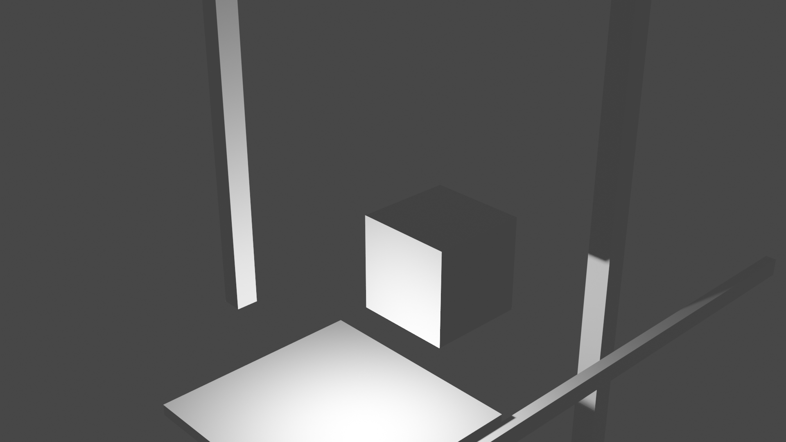
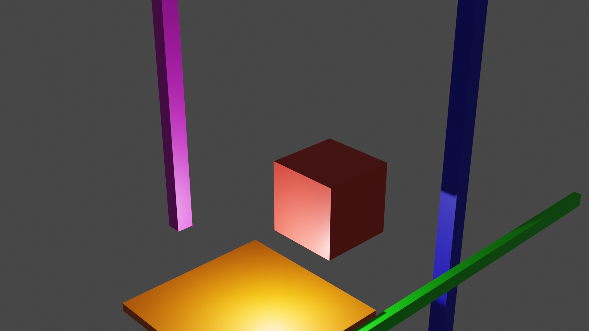
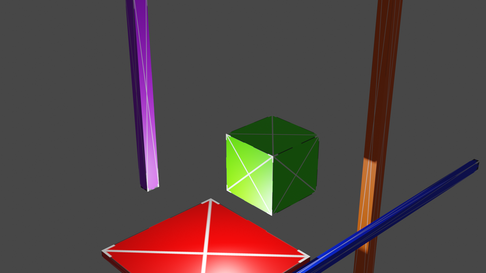
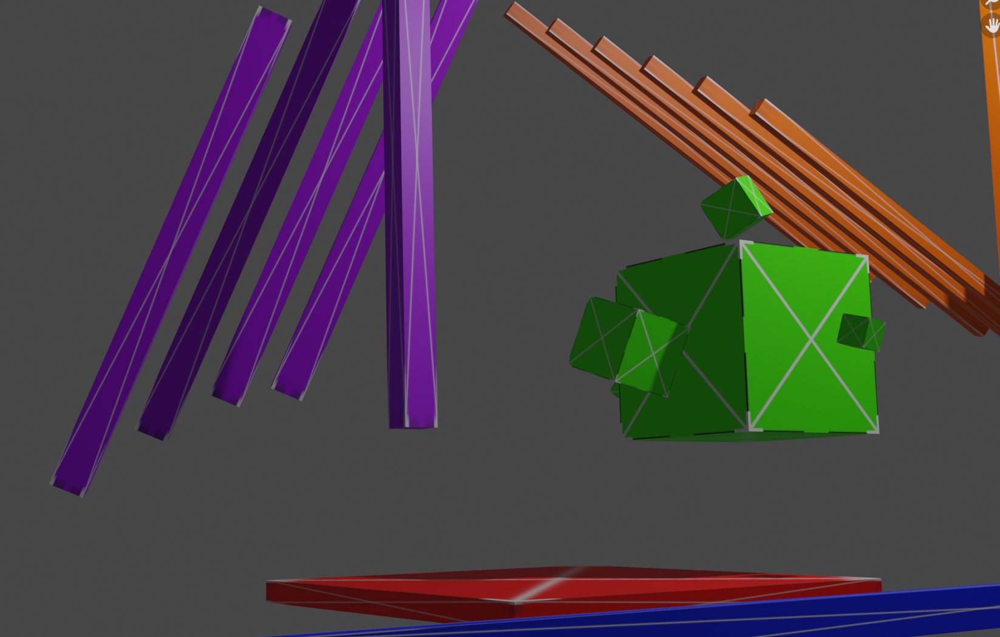

# deccer-cubes

A collection of innocent cubes, to freak out your engine, or not. If not you may receive the "deccer-cubes-approval" role on our discord."

## cubes no-color, no-texture

SM_Floating

## cubes color, no-texture

## cubes no-color, texture

## cubes textured slightly more complex

